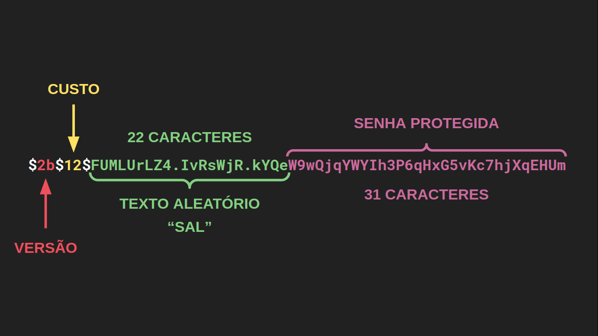

## Node.js e JWT: autenticação com tokens - [Curso](https://cursos.alura.com.br/course/node-jwt-autenticacao-tokens)

## Sumário
- [Introdução](#1-introdução)
- [Protegendo as senhas no banco de dados](#2-protegendo-as-senhas-no-banco-de-dados)
- [Criando um sistema de login escalável](#3-criando-um-sistema-de-login-escalável)
- [Implementando Autenticação com JWT](#4-implementando-autenticação-com-jwt)
- [Implementando o logout com tokens](#)

## 1. Introdução
- O que iremos aprender nesse curso? Olhar com mais calma para os problemas de segurança na aplicação. O que fazer quando o banco de dados é vazado? O cliente que está enviando uma requisição para o servidor, ele é quem diz que é?
- Funções de Hashing - como usar para proteger as senhas de vazamentos
- Sistema de autenticação sem seções - usando tokens (alta escalabilidade) 
- Iremos aprender o que é JWT (JSON Web Token)
- Iremos implementar uma API de um BLOG DO CÓDIGO
    - Algumas funcionalidades: 
        - Adicionar, Listar e Deletar Usuários
        - Adicionar e Listar Posts
        - Aplicação irá conseguir validar o token para poder fazer as requisições
- Preparando o ambiente: 
    - [Baixe o projeto](https://github.com/alura-cursos/blog-do-codigo/archive/aula-0.zip) e digite `npm install`
##  Tive um problema ao instalar as dependencias do projeto, para isso resolvi subir um Container com os seguintes comandos:
- docker run --rm -it -p 3000:3000 node:alpine /bin/sh
- apk add curl make build-base sqlite
- Removi e Atualizei as dependencias do projeto manualmente via package.json
- npm install e start no projeto

## 2. Protegendo as senhas no banco de dados
- Precisamos de uma proteção para as nossas senhas no DB:
    - Precisamos de uma função que receba a nossa senha e transforme para algo aparantemente aleatório
    - Tendo o resultado da função é possível comparar com a senha original e autenticar o usuário
    - Guardamos apenas o resultado da funçao na base 
    - Que tipo de função é essa? Função de espalhamento ou função de hashing
- Função de Hashing:
    - Exemplos: MD5 e SHA-256
        - SHA-256: Muito rápidas (Desvantagem)
            - UM Hacker pode gerar 50milhões de Hashes por segundo com função de Hashing
            - Ataque: Rainbow Table Attack _Procurar sobre_
                - Como previnir: "Temperando" função Hash (Receber uma string pseudo-aleatória de uso único) - Chamado de "SALT"
                - Previnir ainda mais: Adicionar um valor de "CUSTO" - Vai determinar o quão lento a função vai demorar para executar inviabilizando o ataque - "BCRYPT" - No nosso caso vamos usar "BCRYPT.HASH", vamos instalá-lo
- Instalando o BCRYPT:
    - `npm install bcrypt@3.0.8`
## Tive um problema na instalação dos pacotes e resolvemos subir um docker com docker-compose build e docker-compose up
- A partir de agora uso o link https://api.m13930522.orp-1.colaboradores.labgerencianet.com.br/ para acessar o meu servidor
- Estamos usando o arquivo .env e Dockerfile para fazer as configurações
- Após as configurações foi possível visualizar que a rota "Criar um Usuário" está gerando uma senhaHash de forma apropriada, protegendo a senha do usuário
    - Exemplo de saída: `"senhaHash": "$2b$12$VjIS24xe9QZmLU4I.mYTV.LJWLiHgz7yyowg5hm3ZDs3D4BwO8nhW"`
    - O primeiro prefixo, entre cifrões, é a versão do algoritmo. Pode incluir valores como 2b, 2a ou 2y.
    - Em seguida, temos o custo do algoritmo que nós escolhemos. Quanto maior for esse custo mais demorado será para o algoritmo ser executado e, dessa forma, é mais difícil de ser vítima de ataques de força bruta, onde o atacante experimenta várias senhas na tentativa de encontrar a correta
    - Já os 22 caracteres depois do último cifrão formam um texto aleatório, frequentemente apelidado de salt
    - Cuidado com o valor de custo pois, mesmo que seja necessário segurança, colocar um valor muito maior do que a sua máquina suporta pode levar a ataques DoS

- É indicado excluir o arquivo `db.sqlite` para realizar os testes, para resetar os registros no banco de dados
- Nesta aula, aprendemos:
    - Interagir com a API REST usada no curso
    - Identificar vulnerabilidades
    - O que é uma função de hashing
    - As diferenças entre funções de hashing
    - O funcionamento da função de hashing bcrypt
    - Implementar a proteção das senhas no banco de dados usando o bcrypt

## 3. Criando um sistema de login escalável
- Precisamos de um método de login para poder fazer a criação e o delete de usuários e posts
- Diferentes métodos de login:
    - Sessões: Usuario passa Email e Senha -> Servidor envia ID_Sessao e Usuario armazena -> Toda requisicao que o usuário fizer vai ter Requisicao + ID_SESSAO
        - Esse método tem uma desvantagem: Servidor armazena várias sessões, o que pode sobrecarregá-lo em caso de várias usuários logados ao mesmo tempo - Prejudica a escalabilidade da aplicação
        - Vai de encontro ao princípio REST: Usuário não devem depender de um estado guardado no servidor para fazer as requisições - o servidor deve ser Stateless
        - Portanto, aonde vamos guardar o estado? No Cliente!!
    - Assinatura: Usuário envia Email e Senha -> Se estiver correto, servidor devolve ID_USUARIO guardado no DB (Por exemplo) -> Cliente armazena ID_USUARIO -> Usuário envia REQUISIÇÂO + ID_USUARIO nas próximas requisições. Dessa forma o servidor sabe quem é o usuário e sabe o que fazer.
        - Problema: Como servidor tem 100% de certeza de que a requisição que está sendo feita do tipo REQUISIÇÂO + ID_USUARIO é de fato daquele usuário que fez o login previamente? Poderia ser um atacante que chutou um ID_USUARIO e tá tentando se passar por ele.
        - Solução: Servidor assina o ID_USUARIO e entrega apenas para o usuário que teve sucesso no login. Portanto toda requisição vai ter um ID assinado que terá a assinatura verificada pelo servidor a cada requisição.
        - Como implementar? JSON WEB TOKEN! (JWT)
- Estrutura do JSON WEB TOKEN:
    - ID_USUARIO + ASSINATURA = TOKEN
        - Como o token é gerado?
            - PAYLOAD - ID_USUARIO codificado em JSON
            - CABEÇALHO - algoritmo de assinatura usado e tipo do token, em JSON
            - ASSINATURA - HMACSHA256(Base64URL(cabeçalho) + "." + Base64Url(payload), "senha-secreta"))
                - "senha-secreta" -> está guardada no servidor e só ele possui
            - TOKEN é formado por:
                - Token = `Base64Url(CABEÇALHO) + "." + Base64Url(PAYLOAD) + "." + Base64Url(ASSINATURA)`
        - Como o token é verificado?
            - Servidor pega o Token que chegou pra ele, divide nas três seções (Cabeçalho, Payload e Assinatura), Usa o mesmo algoritmo pra gerar uma assinatura a partir do Cabeçalho e Payload que o usuário enviou juntamente com a "senha-secreta" contida no servidor e verifica se a Assinatura está batendo. O que o servidor consegue validar com isso? Se o token passado pelo usuário foi realmente gerado pelo servidor e se ele está correto.
- Algumas definições: Payload, HMAC-SHA256 e Base64Url
- Para aprender mais: [Interface Gráfica para Brincar com JWT](https://jwt.io/)
- Configurando a estratégia local:
    - Onde iremos receber email e senha do cliente:
        - Utilizar `npm i passport@0.6.0` e `npm i passport-local@1.0.0`
        - Criar arquivo estrategias-autenticacao.js em src/usuarios
- Inicializando a estratégia:
    - index.js e app.js do diretório usuario
    - criar o controlador em usuarios-controlador.js
    - Para testar: docker-compose up
- Nesta aula aprendemos: 
    - Diferentes tipos de sistemas de login;
    - As vantagens de um sistema de login por tokens;
    - Como funciona o JSON Web Token;
    - Como implementar uma autenticação local sem sessões

## 4. Implementando autenticação com JWT
- Até agora temos temos três rotas que queremos proteção: Adicionar Post, Efetuar Login e Deletar Usuário. Já implementamos o Efetuar Login
- Como garantir autenticação do usuário sem que ele tenha que enviar email e senha toda hora? Por meio de Token. Quando o usuário fizer login é preciso enviar para um cliente um Token para que seja enviado a cada requisição, vamos implementar a construção desse token
- Construção de tokens:
    - Instalar módulo de JSON Web Token: `npm install jsonwebtoken` versão 8.5.1
    - funçao criaTokenJWT em usuario-controlador.js
    - Executar criaTokenJWT em login e método res.set para enviar o token no cabeçalho da resposta
- Senha segura para o JWT:
    - No processo de criação do token usamos o método jwt.sign(payload, 'senha-secreta')
    - Temos que mudar essa string para uma senha que seja segura, um dos métodos utilizados é um gerador de numeros aleatórios ou [pseudo-aleatórios](https://www.khanacademy.org/computing/computer-science/cryptography/crypt/v/random-vs-pseudorandom-number-generators), no nosso caso, pseudo-aleatórios (randomBytes)
        - Como fazemos isso? `node -e "console.log(require('crypto').randomBytes(256).toString('base64'))"`
    - Dessa forma a nossa senha-secreta fica, mesmo que codificada, dentro do nosso código, o que não é muito interessante. O que pode ser feito é passar essa senha para uma variável de ambiente.
        - Como fazemos isso? Criar um novo arquivo na raiz do nosso projeto `.env`
        - Precisamos de ler esse arquivo `.env` para utilizar as variáveis de ambiente no nosso projeto, como fazemos isso? `npm install dotenv`. No curso foi utilizado a versão 8.2.0
        - DotEnv: 
            - Precisamos executar a configuração do DotEnv no começo do nosso programa (server.js): `require('dotenv').config()`
- Estratégia para JWT:
    - Agora podemos construir as nossas próximas estratégias de autenticação para tokens - Bearer Token
    - Instalar o módulo da estratégia - `npm install passport-http-bearer` - No curso foi utilizado a versão 1.0.1
    - Editar arquivo src/usuarios/estrategias-autenticacao.js
    - Com a BearerStrategy escrita, podemos implementar a estratégia nas rotas de Criação de Post e Deletar Usuário (posts-rotas.js e usuarios-rotas.js)
- Com o token em mãos, vamos testar: criamos um usuário, logamos com o usuário e agora vamos fazer a criação de um post. Onde colocar o token? No Header da requisição: Authorization: Bearer <token>
    - Ou então usar a aba Authorization -> Bearer Token -> Inserir o token e enviar requisiçao
- Tratando erros do login:
    - Nesse momento, a mensagem de erro que aparece ao realizar uma requisiçao de login com senha errada está muito ruim, vamos tratar isso
    - Criar um novo arquivo na pasta usuarios chamado `middlewares-autenticacao.js` e modificar em usuarios-rotas.js para usar esse serviço. Com isso, estratégia local está funcionando
    - Agora devemos fazer para a estratégia Bearer com os Tokens
- Tratando erros do token:
    - Modificar o arquivo middlewares-autenticacao.js
    - Criar middlewaresAutenticacao no index.js do diretorio usuario
- Para saber mais: usando chaves públicas - [Artigo](https://www.pingidentity.com/en/resources/blog/post/jwt-security-nobody-talks-about.html)
- O que aprendemos nessa aula: 
    - Como gerar JSON Web Tokens;
    - Como configurar uma estratégia de autenticação para tokens;
    - Como gerar senhas aleatórias;
    - Como guardar valores em uma variável de ambiente;
    - Como tratar erros de autenticação.
