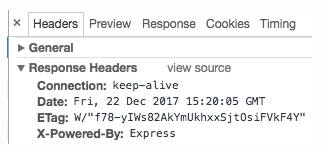

## Node.js: tornando sua aplicação ainda mais segura com pouco esforço - [Artigo](http://cangaceirojavascript.com.br/nodejs-tornando-sua-aplicacao-ainda-mais-segura-com-pouco-esforco/)

- A segurança de uma aplicação web é um requisito não funcional da aplicação, aquele que o cliente não pede, mas evidente que faça parte do produto final. Não precisamos ser experts no assunto para que possamos fazer algo que proteja nossas aplicações.
- Neste artigo apresentarei algumas dicas de segurança que podem ser aplicada em qualquer plataforma, contudo, elas serão exemplificadas através do Express.js.
1. O Controverso header X-Powered-By:
  - Essa informação é um prato cheio para quem deseja buscar por vulnerabilidades na aplicação, pois ela direcionará a pesquisa do malfeitor para a busca de vulnerabilidades conhecidas da plataforma indicada pelo header.

    

- Solução: utilizar X-Powered-By a nosso favor: Em suma, estamos fingindo ser outra plataforma e a busca do malfeitor baseado na informação do header será em vão.

````javascript
const express = require('express')
, app = express()
, ejs = require('ejs')
, bodyParser = require('body-parser');

app.use(bodyParser.json());

// resposta fake!
app.use((req, res, next) => {
    res.set('X-Powered-By', 'PHP/7.1.7');
    next();
});
````

2. Post injection:
- `const product = req.body;` [X]
  - Buscamos as propriedades product.title, product.price e product.description
- Para evitar que o cliente envie indevidamente um JSON com propriedade `created` no banco de dados:
- Solução: arrancar da requisição apenas o que nos interessa
````javascript
 const product = {};
    // garante que o objeto tenha apenas as seguintes propriedades
    product.title = req.body.title;
    product.price = req.body.price;
    product.description = req.body.description;
```` 
3. Leaking de tecnologia através de mensagens de erro:
- Não é raro nos depararmos com aplicações web, inclusive API’s que retornam para o cliente a `stack trace`. No entanto, a informação da pilha exibida pode dar insights sobre a tecnologia utilizada, inclusive informações de infraestrutura.
- No caso do Express, há um middleware padrão de tratamento de erro que exibe uma mensagem simples. Porém, essa simplicidade torna evidente que o Express é a tecnologia utilizada no backend.
- Solução: configurar nosso próprio middleware de tratamento de erro
````javascript
// código anterior omitido
app.use((err, req, res, next) => {
    console.error(err.stack);
    res.status(500).json({ message: 'Houve um problema ao executar a operação. Tente mais tarde'});
});
````
- Conclusão:
  - Não é preciso ir muito além para aumentar a segurança de uma aplicação