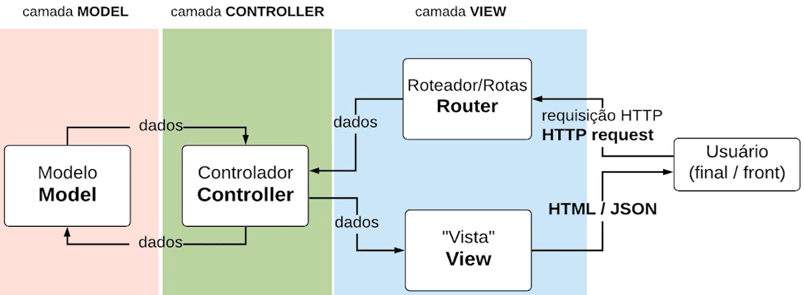

# Node.js: ORM com NodeJS: API com Sequelize e MySQL [Curso](https://cursos.alura.com.br/course/orm-nodejs-api-sequelize-mysql)

## Sumário

- [Estruturando o projeto](#estruturando-o-projeto)
- [Modelos, migrações e seeds](#modelos-migrações-e-seeds)
- [Controladores e Rotas](#controladores-e-rotas)
- [CRUD com Sequelize](#crud-com-sequelize)
- [Relações e associações](#relações-e-associações)
- [Controladores](#controladores)

## Estruturando o projeto
- Objetivo: Escrever uma API para um sistema de controle de alunos e turmas de inglês utilizando um ORM (Sequelize) 
- O que é um ORM? Mapeador de objeto relacional 
- Porque usar Sequelize? Possibilita utilizar javascript para conectar e operar o banco de dados
- O que iremos ver?
  - Criação da API do zero com Sequelize
  - Como a ORM funciona junto a um banco SQL
  - Organizar uma aplicação no padrão MVC
  - CRUD com Sequelize
- Instalação e pré-requisitos:
  - Instalar [MySQL](https://www.mysql.com/downloads/)
- Versão do Node: v10.20.1
- Versão do npm: v6.14.4
- Vou utilizar a versão mais recente do Node.js v16.15.1 para caso dê erro já seja identificado e resolvido.
- Preparando o ambiente:
  - `npm init -y`
  - `npm install express`
  - `npm install body-parser` (converter dados para tipo JSON)
  - `npm install nodemon`
  - Criar arquivo .gitignore com `node_modules` dentro
  - [`npm install mysql2`](https://sequelize.org/docs/v6/getting-started/)
  - `npm install sequelize sequelize-cli path`
  - `npx sequelize-cli init`
  - Criar arquivo `.sequelizerc` na raiz do projeto com o conteúdo para realizar a migration
- Conectando com o banco: 
  - [Baixar pasta de arquivos](https://codeload.github.com/alura-cursos/orm-sequelize-projeto/zip/refs/heads/aula-0)
  - `sudo mysql -u root -p`
    - No meu caso utilizei o comando `mysql -h 127.0.0.1 -u root -p` pois ele está rodando no Docker

- Criar database: `create database escola_ingles`
- Modificar na plataforma Config para avisar o meu projeto que existe uma database que queremos utilizar

## Modelos, migrações e seeds
- Como criar modelos baseados nas tabelas do Diagrama de Bancos:
  - Começar sempre pela tabela que não possui Foreign Key, se possível
  - `npx sequelize-cli model:create --name Pessoas --attributes nome:string,ativo:boolean,email:string,role:string` mudou para `npx sequelize-cli model:generate --name Pessoas --attributes nome:string,ativo:boolean,email:string,role:string`
  - Dois arquivos criados: `/models/pessoas.js` e `XXXXXXX-create-pessoas.js`
    - Criou automaticamente a coluna ID com as restrições:
    ````javascript
    id: {
        allowNull: false,
        autoIncrement: true,
        primaryKey: true,
        type: Sequelize.INTEGER
      },
    ````
    - Criou também duas colunas: createdAt e updatedAt

    ````javascript
    createdAt: {
        allowNull: false,
        type: Sequelize.DATE
      },
      updatedAt: {
        allowNull: false,
        type: Sequelize.DATE
      }
      ````
- Duas funções criadas: up (Criar tabela) e down (Desfazer uma tabela)
- [Data Types](https://sequelize.org/docs/v6/core-concepts/model-basics/#data-types)
- O que são Migrações: migração/transferência de dados entre plataformas
  - Migração com ORM: alterações incrementais e rastreáveis no banco (versionamento de tabelas)
  - Mudanças no Esquema: Coordenar alterações feitas por diferentes pessoas do time nas tabelas do banco
  - Rastrear (e reverter) alterações feitas no banco para debugar conflitos e erros
- Pluralizar tabelas: exemplo - Pessoas (evita erros)
  - Utilizando a opção freezeTableName para “congelar” o nome da tabela, assim o Sequelize não vai tentar pluralizar:

````javascript
  sequelize.define('User', {
  // ... (attributes)
}, {
  freezeTableName: true
});
````
- Gerenciar as alterações com o Sequelize:
  - Comando: `npx sequelize-cli db:migrate` para executar as migrações
  - Entrar na database: `use escola_ingles` e `show tables` para ver tabelas
  - Detalhar a tabela Pessoas: `describe Pessoas`
- Populando o Banco:
  - Exemplo: `insert into Pessoas (nome, ativo, email, role, createdAt, updatedAt) values ("Carla Gomes", 1, "carla@email.com", "estudante", NOW(), NOW());`
  - `select * from Pessoas` para visualizar tabela
- Muito trabalhoso popular a tabela Pessoas manualmente, como resolver? Seeders
  - `npx sequelize-cli seed:generate --name demo-pessoa`. XXXXXXXX-demo-pessoa.js criado. Necessário descomentar as partes
  - `npx sequelize-cli db:seed:all` para conectar com o banco
- Desfazendo Migrações 
  - `npx sequelize-cli db:migrate:undo` para desfazer a última migração realizada
  - Você pode rodar o mesmo comando novamente para ir desfazendo as migrações na ordem em que foram executadas, ou usar o comando:
  - `db:migrate:undo --name [data-hora]-create-[nome-da-tabela].js`
- Desfazendo Seeds:
  - Para desfazer o último seed feito. `npx sequelize db:seed:undo`
  - Para desfazer seeds de uma tabela específica: `npx sequelize-cli db:seed:undo --seed nome-do-arquivo`
  - Para desfazer todos os seeds feitos: `npx sequelize-cli db:seed:undo:all`
  - Ao contrário das migrações, não existe nenhum recurso de “versionamento” de seeds, só é possível incluir no banco e desfazer a operação (o que vai deletar os registros do banco).
    - Se você rodar o :undo em uma tabela e quiser mais tarde utilizar os seeds novamente na mesma tabela, os IDs deles serão outros.
    - Os registros terão novos IDs, pois uma vez deletado o ID nunca é reutilizado. Se você estiver migrando/seedando tabelas relacionadas, é sempre bom conferir os IDs de todas, do contrário o Sequelize vai lançar um erro de relação.

## Controladores e Rotas

- Padrão MVC:



- Criando o controlador:
  - Criar pasta `controllers` na pasta api e um arquivo `PessoaController.js` 
- Organizando as rotas:
  - Criar pasta `routes` e um arquivo `index.js`
- Definindo a primeira rota: `pessoasRoute.js`
## CRUD com Sequelize

- Métodos de CRUD:
  - 200 (OK) - `controllers/PessoaController.js` e `routes/pessoasRoute.js`
  - Métodos do Sequelize para realizar operações de CRUD foram aprendidos
  - Enviar dados através de parâmetros de requisição HTTP
  - Enviar dados através do corpo da requisição HTTP
  - Criar rotas para cada operação
  - Associar as rotas a cada método do controlador Pessoas

## Relações e associações
- Criando mais tabelas: 
  - `npx sequelize-cli model:create`
  - Continuar o processo pelas tabelas que não usam FK - Foreign Keys
    - No nosso caso, Tabela Nível
    - `npx sequelize-cli model:create --name Niveis --attributes descr_nivel:string`
  - Criar tabela Turma:
    - Apenas atributos naturais da tabela
    - `npx sequelize-cli model:create --name Turmas --attributes data_inicio:dateonly`
  - Criar tabela Matrículas:
    - Apenas atributos naturais da tabela
    - `npx sequelize-cli model:create --name Matriculas --attributes status:string`
- Fazendo Associações/Relações:
  - Passar para o Sequelize as chaves estrangeiras de cada tabela (FKs)
  - Quatro Métodos de Associação: HasOne, BelongsTo, HasMany e BelongsToMany
## Controladores